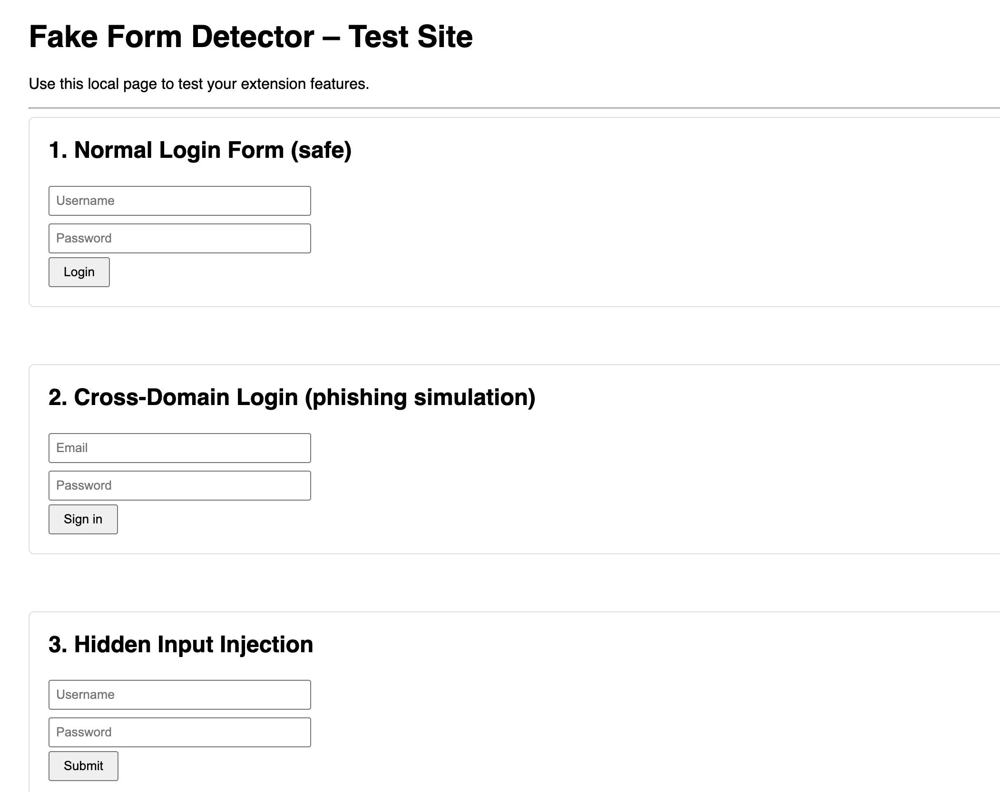
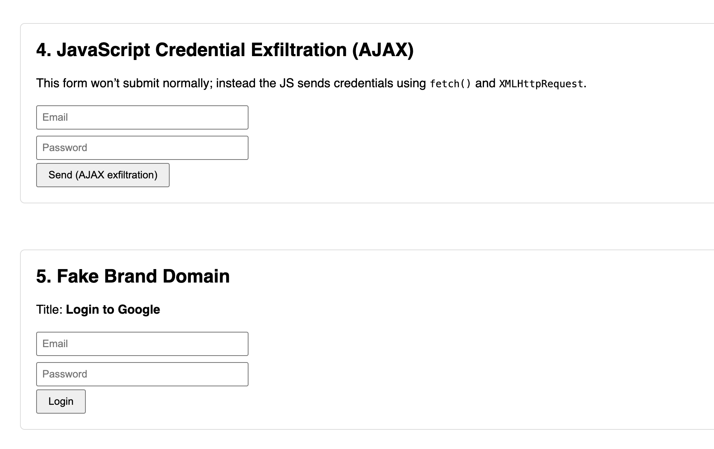
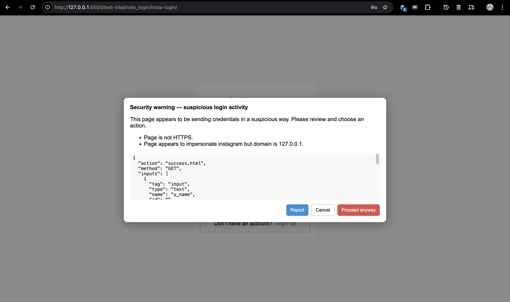

# Fake Form Detection Extension

### Overview

Fake Form Detection is a Chrome browser extension developed as a course project to detect and alert users when they attempt to submit credentials on suspicious login forms.

Fake Form Detection provides **real-time protection against phishing and credential theft**.  
It analyzes every webpage's forms, user interactions, and network requests to detect suspicious behavior such as:

- Fake login pages mimicking Instagram, Gmail, or Facebook  
- Cross-domain password submissions  
- Hidden-field injection  
- AJAX-based credential exfiltration (`fetch()` / `XMLHttpRequest`)  
- Non-HTTPS login pages  
- Brand impersonation based on page titles, meta tags, and images  

The extension uses **DOM heuristics**, **network interception**, and **Google Safe Browsing checks** to warn users before their credentials are exposed.

### Files and Functionality

This repository has two main parts:

#### `extensions/`  
Contains the Chrome extension source code:

- **`manifest.json`** — This file defines the core structure and permissions of the Fake Form Detection Chrome extension. It configures how the extension loads, what pages it can monitor, and which scripts are allowed to run.  
- **`content_script.js`** — This script runs inside every webpage and performs real-time detection of suspicious login or credential-capture behavior. It intercepts user interactions, analyzes form submissions, and blocks unsafe password exfiltration before it reaches a malicious server. 
- **`utils.js`** — This module provides lightweight helper functions used across both the content script and the background service worker. These utilities support domain parsing, fuzzy brand detection, and page analysis heuristics.
- **`service_worker.js`** — This MV3 service worker powers all backend logic for the Fake Form Detection extension. It handles Google Safe Browsing lookups, caches results, and stores phishing reports submitted by users.  

#### `test-site/`  
Contains some sample test fake login forms.

- **`test-2.html`** - 
This standalone HTML file is used to manually test every detection feature of the Fake Form Detection extension.  
  It includes multiple controlled scenarios that simulate both safe and malicious behaviors:
  - Safe login form  
  - Cross-domain credential posting  
  - Hidden field injection  
  - AJAX credential exfiltration (fetch + XHR)  
  - Fake-brand phishing simulation (e.g., “Login to Google” on a non-Google domain)

- **`./insta_login`** - 
This folder contains a perfectly matching fake of the official instagram login page. It mainly exploits AJAX credential exfiltration, does not submit but fetches. It also uses a mail feature which can be run on servers having a mailing feature.

- **`fake-login.html`**-
This consists the most simplest test case for this extension.

### Features

* **Capture-phase click interception**  
  Detects dangerous button-triggered submissions *before* the page’s own JavaScript runs.

* **Deep form analysis**  
  Evaluates action URLs, domain mismatches, HTTPS usage, hidden inputs, and brand imitation.

* **Google Safe Browsing integration**  
  Uses the Safe Browsing API to identify phishing or malware-associated URLs.

* **JavaScript exfiltration detection**  
  Blocks credential leakage via:
  - `fetch()` POST requests  
  - `XMLHttpRequest` POST requests  

* **Programmatic submit protection**  
  Overrides `form.submit()` to intercept non-user-triggered submissions.

* **Warning modal with user options**  
  - Cancel submission  
  - Proceed anyway (with safe click replay)  
  - Report phishing (stored locally)

* **Dynamic form handling (SPA support)**  
  Uses MutationObserver to scan newly added forms automatically.

* **Brand impersonation heuristics**  
  Detects pages visually resembling known brands (Instagram, Facebook, Gmail).

* **Iframe-safe behavior**  
  Gracefully degrades when extension APIs are unavailable.

### Installation

1. Clone or download the repository.
2. Open Chrome and navigate to `chrome://extensions/`.
3. Enable **Developer mode**.
4. Click **Load unpacked** and select the project folder/extension.
5. The extension will now be active.

### How to Run

1. Open any webpage with a login form or load the `test-site/fake-login.html` file in your browser.
2. The content script automatically scans forms on page load and dynamically added forms.
3. If a form is flagged as suspicious, a modal will appear showing:
   * Reasons for suspicion
   * Form details
4. Users can choose to cancel, proceed, or report the form.

### Example

```javascript
// The content script automatically scans forms like this:
window.addEventListener("load", () => {
    scanForms();
});
```

* Suspicious domains: `insta-login.xyz` (fake Instagram)
* Hidden fields count: >2 triggers a warning
* Missing HTTPS triggers a warning

### Testing

1. Load the extension in Chrome using Developer mode.
2. Open demo phishing pages (local or controlled environment) with forms mimicking Instagram, Gmail, or Facebook.
3. Check that warning modals appear for suspicious forms.
4. Open legitimate login pages (Instagram, Gmail) to verify that the extension does not falsely flag them.

### Test Results








